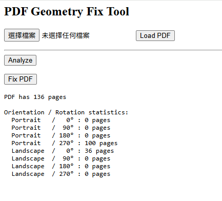

# PDF修正假橫向PDF小工具

## 功能介紹與使用方法

### 功能介紹 


本工具會診斷與修復下列 PDF 幾何問題：  

錯誤 /Rotate 標記導致的假橫向頁面  

Page / Annotation / Stamp 幾何座標不同步  

混合方向 PDF（部分頁面正常、部分頁面錯誤）  

### 基本用法

1. 上傳pdf後
2. 點選 Upload PDF 載入 PDF
3. 點選 Analyze 查看幾何診斷摘要
4. 點選 Fix PDF 下載修正後的檔案

## 安裝方法與技術棧

### 安裝 Setup

```bash
pip install fastapi uvicorn pypdf python-multipart
```
啟動
```bash
uvicorn server:app --reload
```
或直接執行start.bat

啟動後開啟瀏覽器到
```
http://127.0.0.1:8000
```

### 技術棧

| 技術 | 版本 |
|-----|-----|
| Python | 3.13 |
| FastAPI | 0.128.0 |
| Uvicorn | 0.40.0 |
| pypdf | 6.1.0 |
| python-multipart | 0.0.21 |


## 背景

收到需求，需要將pdf上的印章蓋到另一份對應檔案上，由於數量有好幾千頁，不想手動貼，想到能用python+AI解決。  
後來查資料後，得知有pypdf這類庫可以編輯pdf，因此此想法可行。

直接請AI生成蓋章腳本，首先遇到一個問題，有部分頁面印章會亂蓋，找不到原因。  
請AI多log幾個資訊後，發現是有騙子landscape，它的原貌是portrait+270度的rotation  
因此將問題拆成：轉正與蓋印章。 

TODO
蓋印章問題：  
第一個遇到的問題是AI不知道什麼是印章。  
請AI寫一段print每頁的資訊，並比對沒有印章的頁面後，得知印章annotation的標籤是"stamp"。  
後續用annotation和stamp等詞彙，便能精準指出我的需求。

目前蓋印章還沒寫進去UI內

## 筆記

### 修正旋轉方向:

PDF 的畫面幾何實際分成三層：

- Page 世界（全域座標）
- Annotation Rect 世界（互動框世界）
- Stamp local 世界（stamp的local繪圖世界）

它們彼此獨立、具語意層級關係，但不會自動同步。

### Page

Page 內主要由 MediaBox 與 /Rotate 定義世界座標。

在「假橫向 PDF」中，內容其實已經被物理旋轉，但仍殘留 `/Rotate=270` 的邏輯標記。

此流程會直接把 Page 世界轉正：

```python
tf = Transformation().rotate(90).translate(h, 0)
page.add_transformation(tf)
page.mediabox = RectangleObject([0, 0, h, w])
page.rotation = 0
```
也就是把整個世界逆時針旋轉 90° 並平移回第一象限，並同步交換紙張邊界  


### Annots

Annotation Rect 是定義在 Page 世界中的資料欄位，不會自動跟隨 Page CTM。  

因此必須對所有 /Rect 套用同一組同步仿射矩陣，  
讓互動框仍維持在正確的頁面座標位置。  

### Stamps

Stamp 的實際顯示是：
```
Final = PageCTM · ( StampLocalCTM · Geometry )
```
當 PageCTM 被改寫後，Stamp會變成：
```
Final = (PageCTM · M) · ( StampLocalCTM · Geometry )
```
Stamp被多套了一次 M。  

為了讓畫面維持原本正確顯示，需要把 Stamp local 世界轉譯到新世界：  
```
StampLocalCTM := M⁻¹ · StampLocalCTM
```
也就是在 Stamp AP stream 內插入反矩陣並移除舊 /Matrix。  

這樣才能在新 Page 世界下維持相同的最終畫面位置與幾何語意。  
